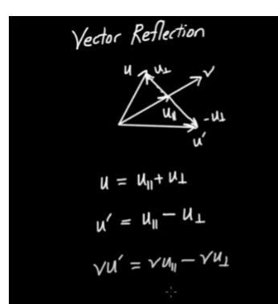
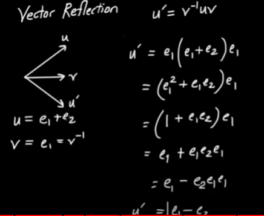
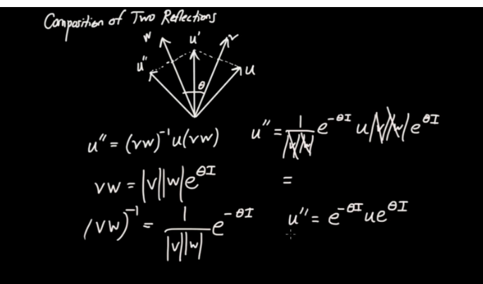
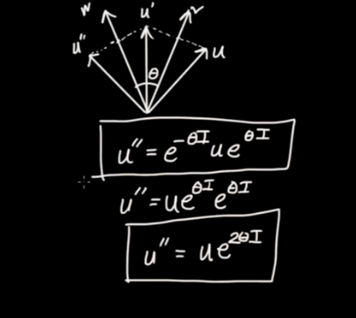

## Geometric product
$$u=a.e1+b.e2$$
$$v=c.e1+d.e2$$
$$uv=u.v + u∧v$$
$$uv=(ac+bd)+(ad-bc).(e1∧e2)$$
$$e1e1=e1.e1+e1∧e1=1$$
$$e1e2=-e2e1$$ 
$$(e1e2)^2=e1e2e1e2=-e2e1e1e2=-1$$
$$e1e2=e1.e2+e1 \wedge e2=e1 \wedge e2 =\mathbf{I} $$

## Mathematical Objects of GA

| Object      | Notation    | grade |
| ----------- | ----------- |----|
| scaler      | 1       | grade-0|
| vectors     | $e1$, $e2$ | grade-1|
| bi-vector   | $e1 \wedge e2 =\mathbf{I}$ |grade-2|

$dim (G(R^2))=4 $

basis =${1,e1,e2,I}$

## Relationship with Complex numbers

let $u=a.e1+b.e2$, then
$$ uI=(a.e1+b.e2)(e1e2) $$
$$ uI=a.e1e1e2+b.e2e1e2$$
Given $e1e1=1$ and $e2e2=1$ we get
 $$uI=a.e2-b.e1$$
 The above is a 90 degree anticlockwise rotation

 Similarly
 $$Iu=e1e2(a.e1+b.e2)$$
 $$Iu=a.e1e2e1+b.e1e2e2$$
 $$Iu=-a.e2+be1$$

 Futhermore
 $$ u(cos(\theta)+sin(\theta)\mathbf{I}) $$
 $$ ue^{\theta\mathbf{I}}=(acos(\theta)-bsin(\theta))e1+(asin(\theta)+bcos(\theta))e2$$

 ## Geometric Algebra in 2D

### Geometric Product
$$uv=u.v+u\wedge v$$
$$vu=u.v-u\wedge v$$
then
$$ u.v=\dfrac{1}{2}(uv+vu)$$
$$ u\wedge v=\dfrac{1}{2}(uv-vu)$$
### Inverse

let $u$ be a vector in $R^2$ with basis $e1$ and $e2$

then the geometric product of $u$ with itself
$$uu=u.u+u\wedge u$$
$$ uu=\Vert {u} \Vert ^ 2$$
which can be written as
$$ \dfrac{u}{\lvert u \lvert ^2}u=1$$
where $ \dfrac{u}{\lvert u \lvert ^2} $ can be considered as the inverse of u

### Paralell
$$u \Vert v \implies uv=vu$$
### Perpendicular 
$$u \bot v \implies uv=-vu$$

### Vector Projection
consider two vector $u$ and $v$
we can project $u$ on $v$, there will
be a paralell component and a perpendicular comp.

Derive $uparalell$ and $uperpendicular$

### Reflection
consider two vector $u$ and $v$. Find $u'$ the reflection of $u$ by $v$.

$u'=u_{par}-u_{per}$

After some manipulation
$$u'=v^{-1}uv$$

## Example
$$u=e1+e2$$
$$v=e1$$

Find reflection of u in v

## Trigonometry in $G(R^2)$
### Dot product
 $$ u . v=\vert u \vert \vert v \vert  cos\theta$$

 ### wedge product
 $$ u \wedge v=\vert u \vert \vert v \vert \sin \theta e1e2$$
 ### geometric product
 $$ uv=u.v+u\wedge v$$
 $$ uv=\vert u \vert \vert v \vert  cos\theta+\vert u \vert \vert v \vert \sin \theta I$$
 $$uv=\vert u \vert \vert v \vert e^{I\theta}$$

## Two Reflections is a rotation

